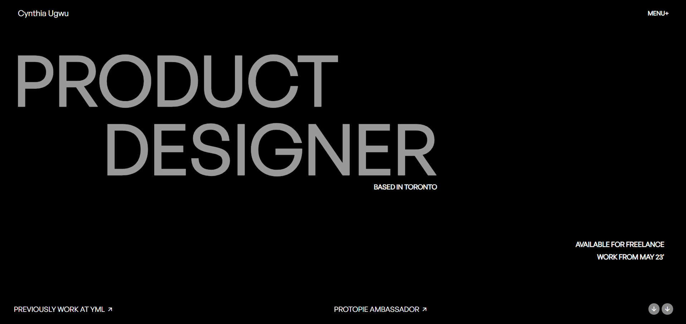

# Cynthia Ugwu Clone

This is a **personal portfolio website** showcasing work, skills, and projects.  
The design is sleek, modern, and interactive, built using **HTML, CSS, and JavaScript** with **GSAP animations** and **Locomotive Scroll** for smooth scrolling.

## 📌  Features
- **Smooth scrolling** with Locomotive Scroll  
- **GSAP animations** for enhanced user experience  
- **Responsive design** optimized for various devices  
- **Minimalist and elegant UI**  
- **Interactive elements** such as animated text and hover effects  

## 📁 Project Structure
```
/project-folder
│── index.html           # Main HTML file
│── styles/
│   ├── Styles.css       # Main CSS file
│   ├── loco.css         # Locomotive Scroll styles
│── images/              # Image assets
│── script.js            # JavaScript file for animations and interactions
│── README.md            # Project documentation
```

## 📜 Technologies Used
- **HTML5**  
- **CSS3**  
- **JavaScript (ES6+)**  
- **GSAP** (GreenSock Animation Platform)  
- **Locomotive Scroll** 

## 📷 Screenshots



## 🚀 Installation & Usage

1. **Clone the repository**  
   ```sh
   git clone https://github.com/himanshu7437/HTML-CSS-JS-Projects.git
   ```
2. **Navigate to the project folder**  
   ```sh
   cd HTML-CSS-JS-Projects
   ```
3. **Open `index.html` in a browser**  
   Simply double-click the `index.html` file or use a local server.

4. Ensure you have an internet connection for external libraries (GSAP, Locomotive Scroll, and Remix Icons).  

## Credits
Inspired by Cynthia Ugwu  

## 📄 License

This project is for educational purposes only. All rights to Cynthia Ugwu's original content belong to them..  

---
⭐ Feel free to contribute or modify this project!
