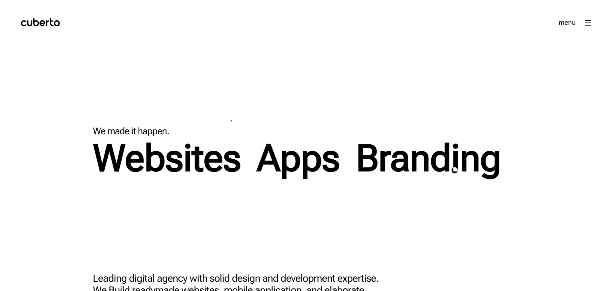
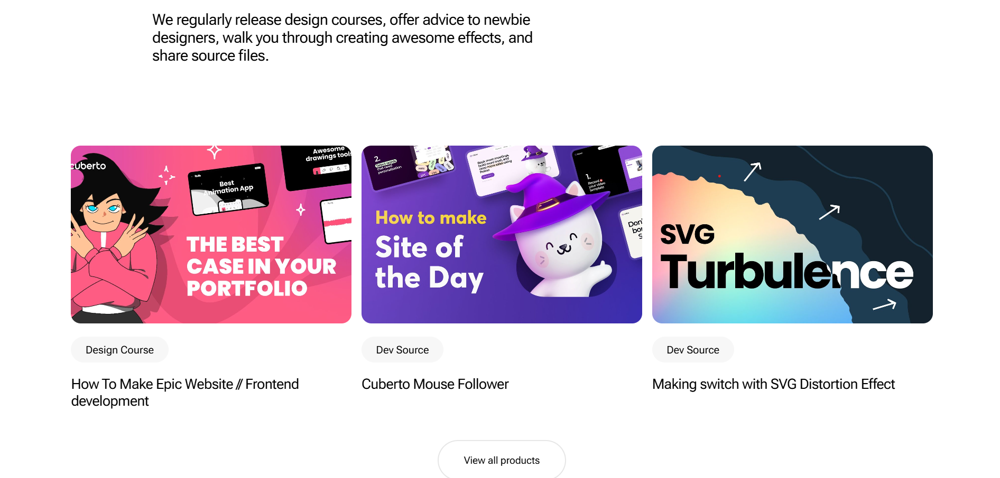

# Cuberto | Digital Product Agency Clone

This project is a digital product agency website inspired by **Cuberto**, showcasing web design, app development, and branding services.

## 📌 Features

- **Responsive Design**: Ensures optimal viewing on all devices.
- **GSAP Animations**: Smooth animations powered by GSAP and ScrollTrigger.
- **Magnetic Hover Effects**: Interactive elements enhanced with Shery.js.
- **Projects Showcase**: Features multiple project highlights.

## 📁 Project Structure

```
/project-folder
│── index.html        # Main HTML file
│── styles.css        # Styling file
│── script.js         # Main JavaScript file
│── assets/           # Images and other assets
│── favicon-32x32.png # Favicon
```

## 📜 Technologies Used

- **HTML5**  
- **CSS3**  
- **JavaScript (ES6)**  
- **GSAP (GreenSock Animation Platform)**  
- **Shery.js**  
- **ControlKit.js**  

## 📷 Screenshots






## 🚀 Installation & Usage

1. **Clone the repository**  
   ```sh
   git clone https://github.com/himanshu7437/HTML-CSS-JS-Projects.git
   ```
2. **Navigate to the project folder**  
   ```sh
   cd HTML-CSS-JS-Projects
   ```
3. **Open `index.html` in a browser**  
   Simply double-click the `index.html` file or use a local server.

## 📄 License

This project is for educational purposes only. All rights to Cuberto's original content belong to them.

---
⭐ Feel free to contribute or modify this project!